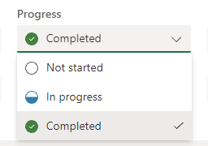
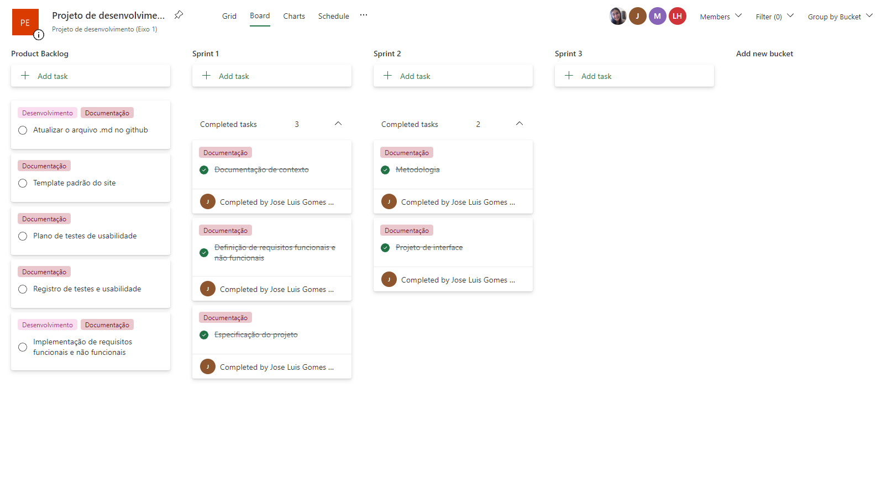

# Metodologia

### Relação de ambiente de trabalho

|Ambiente|Plataforma|Link de acesso|
|------------|-------------|-----------|
|Repositório de código fonte|GitHub|https://github.com/ICEI-PUC-Minas-PMV-ADS/pmv-ads-2023-1-e1-proj-web-t18-time3-plataforma-de-estagios|
|Documentos do projeto|Google Drive|https://docs.google.com/document/d/1JBeba9PBQVL0bLlan_WJM-qbQrdGwd86/edit?usp=share_link&ouid=104293823785896146178&rtpof=true&sd=true|
|Projeto de Interface e  Wireframes|MarvelApp|https://marvelapp.com/prototype/jce2d17/screen/91348857|
|Gerenciamento do Projeto|Planner|https://tasks.office.com/sgapucminasbr.onmicrosoft.com/en-US/Home/Planner#/plantaskboard?groupId=481f1ce7-ccdc-4d12-8012-01f9e2014fe5&planId=3oiyuCOW_06bCHY-wJ-20WQAHCdJ |

## Controle de Versão

A ferramenta de controle de versão adotada no projeto foi o
[Git](https://git-scm.com/), sendo que o [Github](https://github.com)
foi utilizado para hospedagem do repositório.

O projeto segue a seguinte convenção para o nome de branches:

- `main`: versão estável já testada do software
- `unstable`: versão já testada do software, porém instável
- `testing`: versão em testes do software
- `dev`: versão de desenvolvimento do software

Quanto à gerência de issues, o projeto adota a seguinte convenção para
etiquetas:

- `documentation`: melhorias ou acréscimos à documentação
- `bug`: uma funcionalidade encontra-se com problemas
- `enhancement`: uma funcionalidade precisa ser melhorada
- `feature`: uma nova funcionalidade precisa ser introduzida

Discuta como a configuração do projeto foi feita na ferramenta de versionamento escolhida. Exponha como a gerência de tags, merges, commits e branchs é realizada. Discuta como a gerência de issues foi realizada.

> **Links Úteis**:
> - [Tutorial GitHub](https://guides.github.com/activities/hello-world/)
> - [Git e Github](https://www.youtube.com/playlist?list=PLHz_AreHm4dm7ZULPAmadvNhH6vk9oNZA)
>  - [Comparando fluxos de trabalho](https://www.atlassian.com/br/git/tutorials/comparing-workflows)
> - [Understanding the GitHub flow](https://guides.github.com/introduction/flow/)
> - [The gitflow workflow - in less than 5 mins](https://www.youtube.com/watch?v=1SXpE08hvGs)

## Gerenciamento de Projeto

A equipe está organizada da seguinte maneira:

*	__Scrum Master:__ José Luis;
*	__Product Owner:__ Maria Fernanda.
*	__Equipe de Desenvolvimento:__ José, Maria Fernanda, Lafayete, Nicole.
*	__Equipe de Design:__ José, Maria Fernanda, Lafayete, Nicole.

O grupo fará o uso de metodologias ágeis, tendo escolhido o Scrum como base para definição do processo de desenvolvimento. Para organização e distribuição das tarefas do projeto, a equipe está utilizando Planner, devido a instituição utilizar o suite do Office 365. A organização foi estruturada da seguinte maneira: 

*	__Product Backlog:__ Todas as tarefas referentes ao projeto serão adicionadas nesta lista, onde serão rotuladas e conforme o desempenho nos o avanço nos Sprints, serão distribuídas.

* __Sprints:__ Existem listas específicas para cada sprint, tendo em vista que a plataforma Planner permite que o controle do estado da tarefa seja feito na mesma. Dessa forma, indo de encontro com a metodologia Scrum.

O plano que será utilizado pelo grupo está disponível através da URL: 

https://tasks.office.com/sgapucminasbr.onmicrosoft.com/Home/PlanViews/3oiyuCOW_06bCHY-wJ20WQAHCdJ?Type=PlanLink&Channel=Link&CreatedTime=638174316063190000 e é apresentado, no estado atual, pelo figura a seguir:

