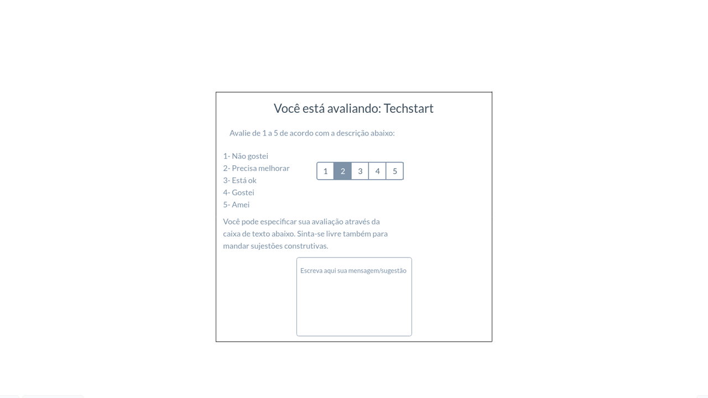

# Projeto de Interface

## User Flow

O diagrama abaixo apresenta a interação do usuário durante a navegação na página web.

## Tela de login

A primeira tela apresenta uma estrutura comum, onde está representando a interface inicial de acesso. Viabilizando uma plataforma segura, opcional fazendo apenas um login ou cadastro.

## Tela de cadastro

Dando início a opção de cadastro, na tela encontrasse o login onde se refere a um cadastro de acesso a privacidade e segurança de seus dados pessoais. Viabilizando uma plataforma segura. 

## Tela de inicio

A tela de inicio destaca-se um visual amplo ao aplicativo de uma forma padrão onde pode se considerar cada ferramenta um símbolo de acesso a página. 
*	Ferramenta de pesquisa. 
*	Ícones com direcionamento padrão. 
*	Plataforma bem dinâmica e acessível. 
*	Lista de categorias. 
*	Direcionamento de cada estágio e suas informações bem detalhadas e sem melindres. 

## Tela favoritos

De acordo com o tema pode-se observar que a versão do aplicativo tem a disponibilidade e acesso a salvar estágio que interessam o universitário de acordo com sua necessidade. 

## Tela da ferramenta de currículo

Afunilando mais a estratificação do layout de um aplicativo, pode-se observar a ferramenta de currículo, onde direciona a uma plataforma de cadastro pessoal de cada universitário que se deseja se candidatar a vaga aberta de um estágio, nele pode se observar todas os critérios de um cadastramento necessário. 

## Tela de alteração cadastral

Neste layout podemos observar ferramentas de direcionamento e comodidade para alterar seus dados pessoais necessários para sua sinalização perante a vaga que se inscreveu. 
*	Como foto de perfil.  
*	Contato.  
*	Alteração de senha.  
*	Alteração de e-mail.

## Tela de avaliação de empresas

Para trazer uma melhoria de acesso, de layout, ferramentas em geral, esta tela dá ao estudante a oportunidade de expressar sua opinião sobre as empresas e as oportunidades de estágio, acesso levando em consideração pontos positivos e negativo. Com o intuito de uma melhoria de acesso de uma forma geral aos universitários. 

