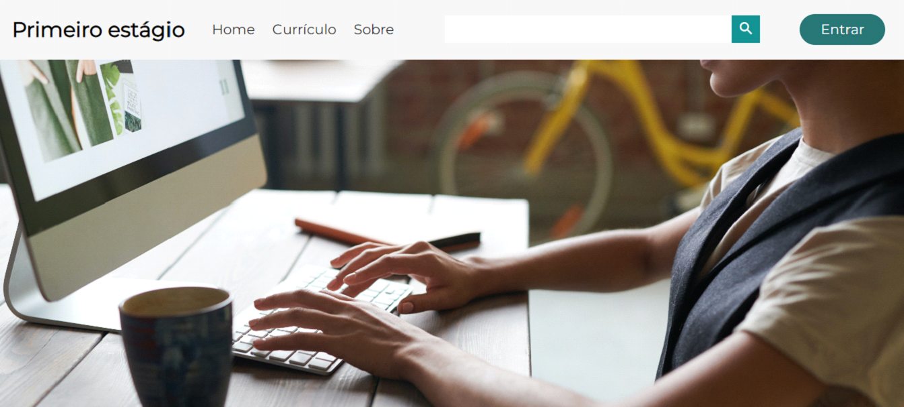
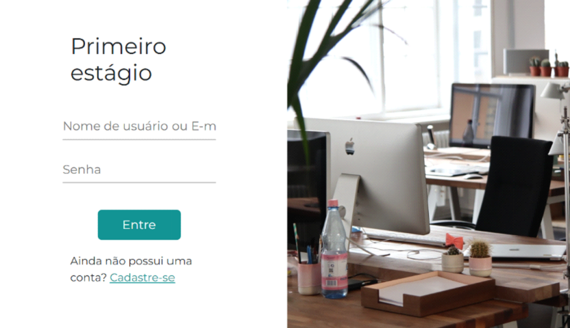
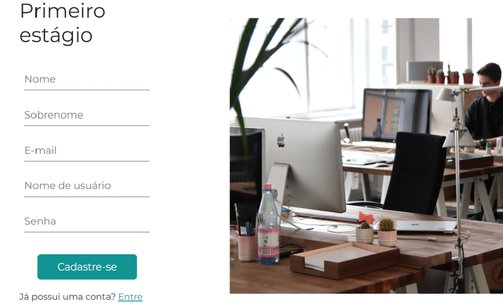
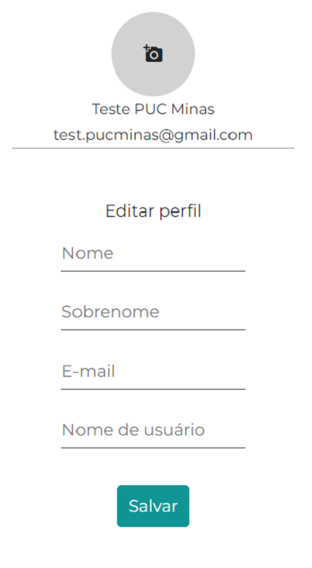

# Template padrão do site

Pré-requisitos: <a href="2-Especificação do Projeto.md"> Especificação do Projeto</a>, <a href="3-Projeto de Interface.md"> Projeto de Interface</a>, <a href="4-Metodologia.md"> Metodologia</a>

Layout padrão do site (HTML e CSS) que será utilizado em todas as páginas com a definição de identidade visual, aspectos de responsividade e iconografia.

O template criado está disponível no repositório https://github.com/ICEI-PUC-Minas-PMV-ADS/pmv-ads-2023-1-e1-proj-web-t18-time3-plataforma-de-estagios.git e é composto pelos seguintes layouts 
- **Página Principal** 
- **Tela de login** 
- **Tela de cadastro** 
- **Navegador**
A responsividade do site Primeiro Estagio segue o padrão do Bootstrap.

## Página Principal 

Tela que abrange todas as visualizações iniciais do site e a lista de informações gerais.

## Tela de login

Esta tela exibe e permite que o usuário digite seu nome de usuário e senha para acessar o conteúdo do site ou aplicação.

## Tela de Cadastro 

Pagina que solicita informações pessoais do usuário, as informações coletadas são o objetivo de criar uma conta de usuário, oferecendo acesso aos serviços e funcionalidades disponíveis na plataforma digital.

## Perfil

Essa página permite que o usuário atualize as informações de sua conta no site

> **Links Úteis**:
>
> - [CSS Website Layout (W3Schools)](https://www.w3schools.com/css/css_website_layout.asp)
> - [Website Page Layouts](http://www.cellbiol.com/bioinformatics_web_development/chapter-3-your-first-web-page-learning-html-and-css/website-page-layouts/)
> - [Perfect Liquid Layout](https://matthewjamestaylor.com/perfect-liquid-layouts)
> - [How and Why Icons Improve Your Web Design](https://usabilla.com/blog/how-and-why-icons-improve-you-web-design/)