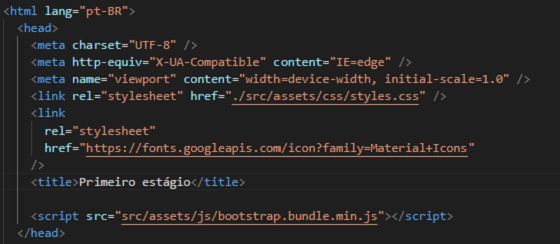

# Programação de Funcionalidades

Pré-requisitos: <a href="2-Especificação do Projeto.md"> Especificação do Projeto</a>, <a href="3-Projeto de Interface.md"> Projeto de Interface</a>, <a href="4-Metodologia.md"> Metodologia</a>, <a href="3-Projeto de Interface.md"> Projeto de Interface</a>, <a href="5-Arquitetura da Solução.md"> Arquitetura da Solução</a>

O site deve apresentar na aba inicial login e senha (RF-01) 
As informações são armazenadas no LocalStorage com estruturas dados baseados em JSON.
O site deve apresentar na aba login uma aba para cadastro (RF-02)
As informações são armazenadas no LocalStorage com estruturas dados baseados em JSON.
O site deve exibir em todas as abas o layout da marca (RF-03)

O site deve apresentar no menu principal uma lupa para busca de vagas (RF-04)

O site deve exibir uma aba onde os usuários alterem seus dados (RF-09)
As informações são armazenadas no LocalStorage com estruturas dados baseados em JSON.

## Requisitos atendidos

- **RF-01**
- **RF-02**
- **RF-03**
- **RF-04**
- **RF-05**

## Artefatos da funcionalidade

- **Index.html**
- **Perfil.html**
- **Login.html**
- **Style.css**
- **Perfil.css**
- **Cadastro.js**
- **Login.js**
- **Paginaprincipal.js**

## Estrutura de dados

## Instruções de acesso

- **Faça o download do arquivo do projeto (ZIP) ou clone do projeto no GitHub;**
- **Descompacte o arquivo em uma pasta específica;**
- **Abra o Visual Studio Code e execute o Live Server;**
- **Abra um navegador de Internet.**

Implementação do sistema descritas por meio dos requisitos funcionais e/ou não funcionais. Deve relacionar os requisitos atendidos os artefatos criados (código fonte) além das estruturas de dados utilizadas e as instruções para acesso e verificação da implementação que deve estar funcional no ambiente de hospedagem.

Para cada requisito funcional, pode ser entregue um artefato desse tipo

> **Links Úteis**:
>
> - [Trabalhando com HTML5 Local Storage e JSON](https://www.devmedia.com.br/trabalhando-com-html5-local-storage-e-json/29045)
> - [JSON Tutorial](https://www.w3resource.com/JSON)
> - [JSON Data Set Sample](https://opensource.adobe.com/Spry/samples/data_region/JSONDataSetSample.html)
> - [JSON - Introduction (W3Schools)](https://www.w3schools.com/js/js_json_intro.asp)
> - [JSON Tutorial (TutorialsPoint)](https://www.tutorialspoint.com/json/index.htm)